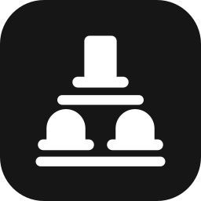
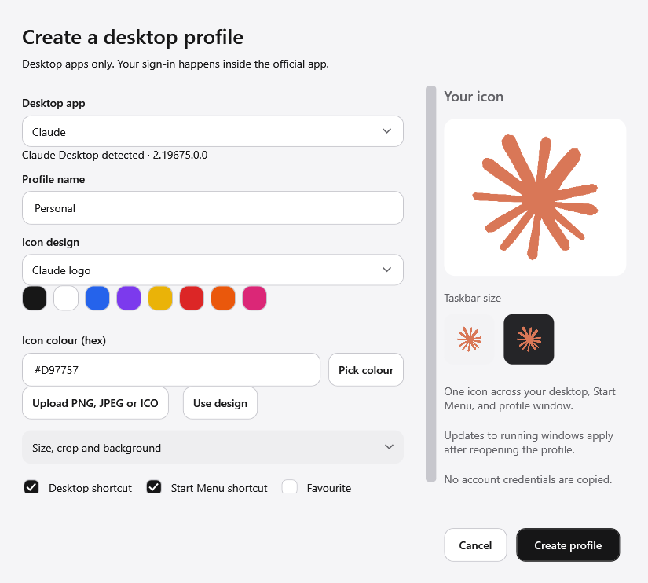

<p align="center"></p>
<h1 align="center">Hatrack</h1>
<p align="center"><strong>Run multiple Claude Desktop and Codex Desktop accounts on Windows.</strong><br>Open a second account without signing out. A free, open-source account switcher with separate profiles, shortcuts and taskbar icons.</p>
<p align="center"></p>
<p align="center">
<a href="https://github.com/MuneefMumthas/hatrack/releases/latest"></a>
<a href="https://github.com/MuneefMumthas/hatrack/releases"></a>
<a href="https://github.com/MuneefMumthas/hatrack/stargazers"></a>
<a href="LICENSE"></a>

</p>
<p align="center"><a href="https://github.com/MuneefMumthas/hatrack/releases/latest/download/Hatrack-Setup.exe"></a></p>
<p align="center"><a href="docs/guides/second-claude-account.md">Second account guide</a> · <a href="docs/README.md">All docs</a> · <a href="CHANGELOG.md">Changelog</a></p>

<p align="center"><a href="docs/images/hatrack-demo.mp4"></a></p>

Claude Desktop and Codex Desktop sign in to one account at a time. If you have a personal account, a work account and a client account, you sign out and back in all day, and you can't keep two accounts open side by side. Hatrack gives each account its own **profile**: a separate data folder, a Desktop and Start Menu shortcut, and its own taskbar icon. Click the hat you need.

> **Preview.** Hatrack is a preview build for Windows 11 x64. Separate local data is implemented; independent signed-in sessions are still going through the [acceptance checklist](docs/ACCEPTANCE.md). Desktop apps only, not Claude Code or Codex CLI.

## Features

| | |
| --- | --- |
| **Multiple accounts** | One profile per account for Claude Desktop and Codex Desktop, each with its own local data. |
| **Your icons** | Recolour the real Claude and Codex logos, or upload a PNG, JPEG or ICO. Preview it at taskbar size. |
| **Real shortcuts** | Desktop and Start Menu shortcuts, with a separate taskbar identity per profile. |
| **Finds what you have** | Detects installed desktop apps and existing profile folders. Manual locate when detection misses. |
| **Nothing leaves your PC** | No Hatrack account, no telemetry, no cloud sync. Credentials are never copied. |
| **Safe by default** | Never overwrites shortcuts it didn't create. Removing a profile keeps its data. |

## Get started

1. Download **Hatrack-Setup.exe** from [Releases](https://github.com/MuneefMumthas/hatrack/releases/latest) and run it. No .NET, Node or terminal needed.
2. Open Hatrack. It detects Claude Desktop and Codex Desktop. If one is missing, use **Official download** or **Locate desktop app**.
3. Choose **Create profile**, pick the app, name it (for example *Work*), and choose an icon colour.
4. Choose **Open** and sign in inside the official app. Repeat for each account.

The installer is not code-signed yet, so Windows SmartScreen may warn you. Choose **More info → Run anyway** only for a file you downloaded from this repository's Releases page, and compare it with `SHA256SUMS.txt`.



## Questions

### How do I use a second Claude account on Windows without logging out?

Create a second profile in Hatrack (for example *Work*) and open it. It starts Claude Desktop with its own data folder, so you sign in to the second account there while your first account stays signed in to the original app or another profile.

### Can I run two Claude Desktop accounts at the same time?

Yes. Each profile is its own Claude Desktop window with its own taskbar icon, so personal and work accounts can be open side by side. Independent sign-in across vendor updates is still being verified in this preview.

### How do I switch between Claude accounts quickly?

Click the profile's Desktop or Start Menu shortcut, or its pinned taskbar icon. Each one opens straight into its own account; there is nothing to sign out of.

### Does it work with multiple Codex Desktop accounts?

Yes. Each Codex profile gets its own `CODEX_HOME`, desktop state folder and file-based credentials. The ordinary ChatGPT desktop app is not supported.

### Does it work with Claude Code or the Codex CLI?

No. Hatrack is for the desktop apps. The command-line tools already support separate configuration folders.

### What happens when Claude or Codex updates?

If Hatrack hasn't been tested with the new version, it asks once before opening a profile. Your data is never reset.

### Is it safe? Does it see my password?

You sign in inside the official app. Hatrack never copies credentials, has no account, and sends no telemetry. The source is all here.

### Is it made by Anthropic or OpenAI? Mac or Linux?

No, it's an independent open-source project. Windows 11 x64 only for now.

## Hatrack compared with other ways

| Approach | Two accounts open at once | Desktop app features | Effort |
| --- | --- | --- | --- |
| Sign out and back in | No | Yes | Every switch |
| One browser profile per account | Yes | No, web only | Low |
| A separate Windows user per account | No, one session at a time | Yes | High |
| Hand-made shortcuts with `--user-data-dir` | Yes | Yes | Manual, and taskbar icons merge |
| **Hatrack** | **Yes** | **Yes** | **A few clicks, own icon per account** |

## How separation works

- **Claude Desktop:** a dedicated `--user-data-dir` and `--disk-cache-dir` per profile.
- **Codex Desktop:** a dedicated `CODEX_HOME`, `CODEX_ELECTRON_USER_DATA_PATH` and Chromium `--user-data-dir`, with file-based credentials.
- **Windows:** a permanent profile ID, its own AppUserModelID, icon file and shortcuts.

Profiles share the official installed app but not its data. This is local-state separation, not a security sandbox: all profiles run as your Windows user. See [setup and importing](docs/SETUP.md) and [security](SECURITY.md).

## Compatibility

| Component | Status |
| --- | --- |
| Windows 11 x64 | Supported |
| Claude Desktop | Launch configuration implemented; signed-in isolation acceptance pending. Tested with 2.19675.0.0. |
| Codex Desktop | Launch configuration implemented; signed-in isolation acceptance pending. Tested with 26.930.2377.0. |
| Claude Code, Codex CLI, macOS, Linux | Not supported |

Evidence: [compatibility.json](compatibility.json) and [build verification](docs/BUILD-VERIFICATION.md).

## Privacy

No telemetry, no Hatrack account, no uploads. Profile data lives under `%LOCALAPPDATA%\Hatrack\profiles\<id>`. Uninstalling keeps it. Diagnostics omit credentials, conversations, account IDs and paths.

**Upgrading from Profiles 0.1.x:** Hatrack was called Profiles. Your existing `%LOCALAPPDATA%\Profiles` catalogue, profile data and pinned taskbar items keep working, and the installer repairs existing shortcuts.

## Build from source

Needs Windows, the .NET 10 SDK and Inno Setup 6.

```powershell
dotnet run --project tests/Hatrack.Tests -c Release
powershell -ExecutionPolicy Bypass -File scripts/build.ps1
```

See [contributing](CONTRIBUTING.md), [publishing a release](docs/PUBLISHING.md) and [the launch plan](docs/LAUNCH.md).

## Built with

<p></p>

    

## Contributing

Bug reports with steps to reproduce, compatibility results for new Claude or Codex versions, and pull requests are welcome. Start with [CONTRIBUTING.md](CONTRIBUTING.md) and the [code of conduct](CODE_OF_CONDUCT.md).

If Hatrack saves you from signing in and out, a star helps other people find it.

## Licence

MIT © 2026 Muneef Mumthas. Claude and Codex logos and names belong to their owners and are not covered by the MIT licence. Hatrack is not affiliated with or endorsed by Anthropic or OpenAI. See [notices](THIRD-PARTY-NOTICES.md).

## Star history

<a href="https://star-history.com/#MuneefMumthas/hatrack&Date">
<picture>
<source media="(prefers-color-scheme: dark)" srcset="https://api.star-history.com/svg?repos=MuneefMumthas/hatrack&type=Date&theme=dark">

</picture>
</a>

<p align="center"></p>
